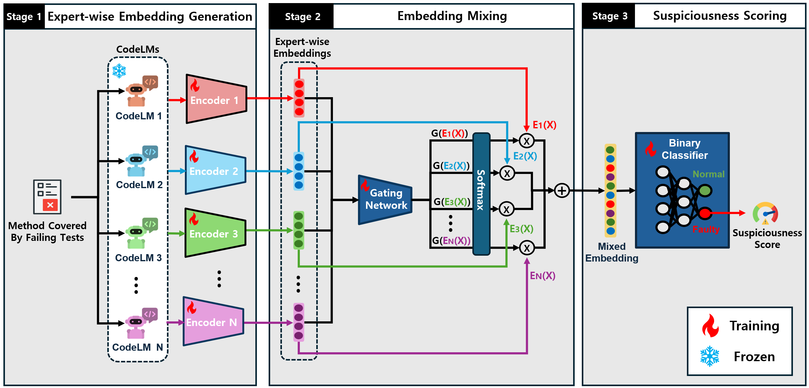

## 📄 MixFL: Fault Localization with Mixture of Language Models for Code  
This is the online repository for the FSE 2026 submission, **"MixFL: Fault Localization with Mixture of Language Models for Code"**.

### 🖼️ Overview Image



### 🧪 Dataset  
We use **Defects4J-V1.4.0**.  
> ⚠️ Note: The buggy items in v1.4.0 are identical to those in v1.2.0. We choose v1.4.0 to avoid issues in v1.2.0.

---

## 🚀 Run MixFL

### 1. Generate Code and Comment Embeddings  
For each method covered by failing test cases, we generate embeddings using each CodeLM (for both code and comments).

```bash
./LLM_embeddings/generate_embeddings_1.sh
```

> Embeddings will be saved in: `LLM_embeddings/defects4j_1.4.0_chunks/`

---

### 2. Run Leave-One-Out Validation  
For **all CodeLM combinations**, run leave-one-out validation for each project.

```bash
python leave_one_out_project_all.py
```

---

### 📁 Check Results  
All experiment results will be stored in the `results/` directory.

---


